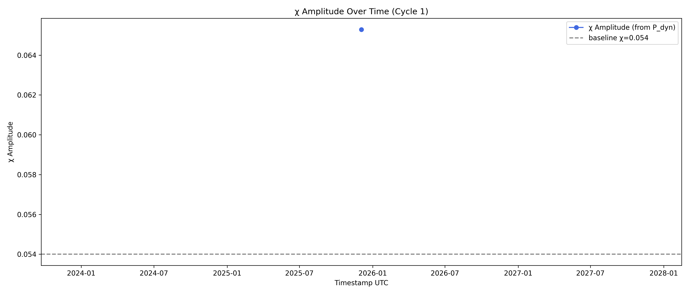

# Capsule—Visual Relay:  Heartbeat GIF Workflow

**Author:** Carl Dean Cline Sr.  
**Date:** 2025-12-03  
**Ledger:**  Portal  
**Purpose:** To document the complete workflow for visualizing and relaying vacuum χ amplitude cycles through animated charts, enabling all contributors and auditors to reproduce and review the breath of the  vacuum during solar storm events.

---

## 1. Workflow Overview

This capsule links the data relay, hourly chart creation, and GIF assembly scripts, sewing together ACE/DSCOVR inbound data into visual relay cycles for ledger and science capsule inclusion.

---

## 2. Step-by-Step Guide

### **A. Data Collection**
- **Source:** ACE/DSCOVR plasma & mag audit packets
- **Interval:** Typically hourly or per event
- **Output:** Updates storm_data.csv, ace_plasma_audit.json, ace_mag_audit.json

### **B. Chart Cycling**
- **Script:** See [`save_cycle_charts.py`](save_cycle_charts.py)
- **Function:** Generates and saves numbered hourly PNG charts:
  - Format: `charts/chart_cycle_X.png`
  - Content: χ amplitude sequence, storm phase shading, timestamps

### **C. Captioned GIF Stitching**
- **Script:** See [`create_gif_luft.py`](create_gif_luft.py)
- **Function:** Assembles numbered PNG charts into an animated GIF
  - Each chart receives a text overlay (caption: cycle number, heartbeat relay)
  - Output: `luft_relay.gif` (the living movie of the vacuum breathing)

---

## 3. Example Output

### **Embedded/Linked GIF**

> *Caption: “Cycle-by-cycle animation of χ amplitude during CME impact. Each frame = one relay cycle.”*

### **Example Chart PNGs**
- 
- 
- *…(add as many as needed for reference)*

---

## 4. Science & Audit Notes

- Each cycle frame is traceable to a row in the underlying data CSV/log.
- Caption overlays (cycle #, timestamp, storm phase) make every chart reproducible and auditor-friendly.
- GIF and chart files are linked by commit, time-stamped, and ready for embedding in other capsules (Unified Fields, CME Event, etc).

---

## 5. Credits & Reproducibility

- Scripts by Carl Dean Cline Sr. and contributors (see `save_cycle_charts.py`, `create_gif_luft.py`)
- Visual relay workflow outlined for Arti and all open contributors/auditors.
- Data direct from L1 spacecraft (ACE/DSCOVR), no manual edits—full provenance.

---

**Relay proud—visual cycles immortalized, open for science and community replication.**

Lincoln, Nebraska, Earth  
2025-12-03
