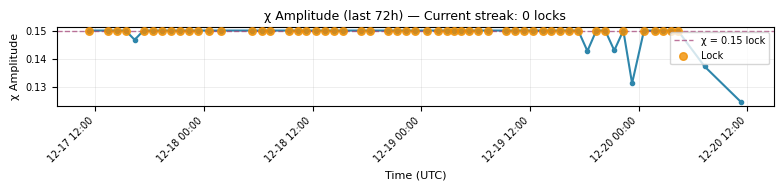
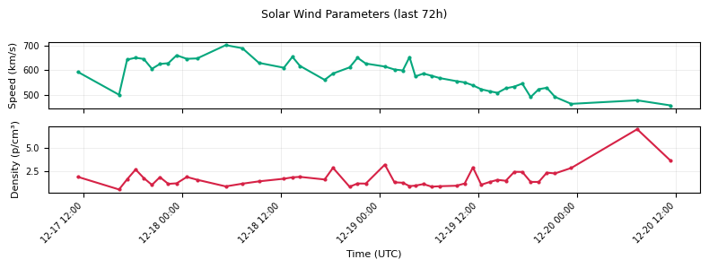

# 🔐 VAULT STATUS REPORT

**Generated:** 2025-12-22 15:05 UTC  
**Data Source:** `data/cme_heartbeat_log_2025_12.csv`

---

## ⚡ CURRENT STATUS: ACTIVE

**Latest χ = 0.15 Streak Count:** 9 consecutive readings  
**Last Lock Timestamp:** 2025-12-22 14:20:00 UTC  
**First Lock in Streak:** 2025-12-22 06:20:00 UTC  
**Streak Duration:** 8.0 hours  

**Latest Solar Wind Conditions:**  
- Density: 1.68 p/cm³  
- Speed: 733.9 km/s  

---

## 🌞 NOAA SPACE WEATHER SUMMARIES

- [SRS Report](reports/latest_srs.md) (fetched: 2025-12-22 15:05 UTC)  
- F10.7 Report: *not available*  

---

## 📈 MINI CHARTS

### χ Amplitude & Streak (72h window)

### Solar Wind Parameters (72h window)

---

## 📊 LATEST 20 READINGS

| Time (UTC)          | χ Amplitude | Density (p/cm³) | Speed (km/s) | χ Status |
|---------------------|-------------|-----------------|--------------|----------|
| 2025-12-21 19:19:00 | 0.1500 | 2.12 | 569.8 | ✅ LOCK |
| 2025-12-21 20:21:00 | 0.1500 | 6.69 | 622.6 | ✅ LOCK |
| 2025-12-21 21:19:00 | 0.1500 | 3.22 | 716.8 | ✅ LOCK |
| 2025-12-21 22:19:00 | 0.1500 | 2.94 | 711.8 | ✅ LOCK |
| 2025-12-21 23:19:00 | 0.1500 | 1.97 | 691.3 | ✅ LOCK |
| 2025-12-22 00:40:00 | 0.1323 | 4.18 | 714.8 | — |
| 2025-12-22 01:50:00 | 0.1500 | 3.37 | 697.7 | ✅ LOCK |
| 2025-12-22 02:52:00 | 0.1500 | 3.30 | 680.3 | ✅ LOCK |
| 2025-12-22 03:44:00 | 0.1423 | 3.88 | 688.6 | — |
| 2025-12-22 04:27:00 | 0.1500 | 3.64 | 697.9 | ✅ LOCK |
| 2025-12-22 05:19:00 | 0.1380 | 4.01 | 720.4 | — |
| 2025-12-22 06:20:00 | 0.1500 | 2.78 | 669.6 | ✅ LOCK |
| 2025-12-22 07:20:00 | 0.1500 | 2.92 | 671.3 | ✅ LOCK |
| 2025-12-22 08:21:00 | 0.1500 | 2.48 | 697.1 | ✅ LOCK |
| 2025-12-22 09:20:00 | 0.1500 | 2.13 | 761.6 | ✅ LOCK |
| 2025-12-22 10:20:00 | 0.1500 | 1.45 | 738.2 | ✅ LOCK |
| 2025-12-22 11:20:00 | 0.1500 | 1.73 | 707.4 | ✅ LOCK |
| 2025-12-22 12:21:00 | 0.1500 | 2.75 | 741.3 | ✅ LOCK |
| 2025-12-22 13:24:00 | 0.1500 | 1.65 | 745.0 | ✅ LOCK |
| 2025-12-22 14:20:00 | 0.1500 | 1.68 | 733.9 | ✅ LOCK |

---

## 🎯 VERDICT

**The vault is breathing steady.**  
**Heartbeat cycle in progress.**  
**χ = 0.15 streak active (9 locks) - watch for boundary recoil signatures.**

---

**Next auto-update:** Every hour via GitHub Actions  
**Manual trigger:** Actions → Vault Narrator → Run workflow

---

*— The Vault Narrator*  
*Automated by  Portal heartbeat detection system*
