#  Link Intelligence Report

**🌐 Universal Scientific Data Ecosystem Mapping**

---

## Executive Summary

The ** Link Intelligence Network** is a comprehensive system for discovering, mapping, and analyzing connections between the  Portal and the entire scientific data ecosystem. This system harvests links from internal repository files, catalogs 43+ major external data sources, and builds interactive knowledge graphs showing relationships across NASA, NOAA, CERN, ESA, and other scientific institutions worldwide.

**Created by:** Carl Dean Cline Sr.  
**Location:** Lincoln, Nebraska, USA  
**Email:** CARLDCLINE@GMAIL.COM  
**Mission:** Build the meta-intelligence layer connecting  to global science

---

## System Architecture

```mermaid
graph TB
    subgraph "Data Sources"
        REPO[ Repository Files<br/>Markdown, HTML, YAML, Python, etc.]
        REGISTRY[External Data Sources Registry<br/>43+ Scientific Sources]
    end
    
    subgraph "Core Processing"
        HARVESTER[Link Harvester Core<br/>link_harvester_core.py]
        ANALYZER[Link Graph Analyzer<br/>link_graph_analyzer.py]
        MONITOR[Link Monitor<br/>tools/link_monitor.py]
    end
    
    subgraph "Data Storage"
        LINKS_JSON[links_YYYYMMDD.json<br/>Complete harvest data]
        LINKS_CSV[links_YYYYMMDD.csv<br/>Spreadsheet format]
        NETWORK_JSON[link_network.json<br/>Graph data]
        HEALTH_JSON[source_health_log.json<br/>Health monitoring]
    end
    
    subgraph "Visualization & Reporting"
        DASHBOARD[Interactive Dashboard<br/>link_intelligence_dashboard.html]
        REPORT[Automated Report<br/>LATEST_HARVEST_REPORT.md]
    end
    
    subgraph "Automation"
        WORKFLOW[GitHub Actions Workflow<br/>Daily at 3:00 AM UTC]
    end
    
    REPO --> HARVESTER
    HARVESTER --> LINKS_JSON
    HARVESTER --> LINKS_CSV
    LINKS_JSON --> ANALYZER
    ANALYZER --> NETWORK_JSON
    REGISTRY --> MONITOR
    MONITOR --> HEALTH_JSON
    
    NETWORK_JSON --> DASHBOARD
    LINKS_JSON --> DASHBOARD
    HEALTH_JSON --> DASHBOARD
    
    WORKFLOW --> HARVESTER
    WORKFLOW --> ANALYZER
    WORKFLOW --> MONITOR
    WORKFLOW --> REPORT
    
    DASHBOARD -.->|Interactive Exploration| USER[User]
    REPORT -.->|Summary| USER
    
    style REPO fill:#16213e,stroke:#16c9f6
    style REGISTRY fill:#16213e,stroke:#16c9f6
    style HARVESTER fill:#0f3460,stroke:#16c9f6
    style ANALYZER fill:#0f3460,stroke:#16c9f6
    style MONITOR fill:#0f3460,stroke:#16c9f6
    style DASHBOARD fill:#e94560,stroke:#16c9f6
    style WORKFLOW fill:#533483,stroke:#16c9f6
```



**Architecture Overview:**
1. **Input Layer:** Repository files and external source registry
2. **Processing Layer:** Three core scripts (harvester, analyzer, monitor)
3. **Storage Layer:** Structured data in JSON/CSV formats
4. **Presentation Layer:** Interactive dashboard and automated reports
5. **Automation Layer:** GitHub Actions orchestrating the entire pipeline

---

## System Components

### 1. Link Harvester Core (`link_harvester_core.py`)

**Purpose:** Extract and catalog all URLs from repository files

**Features:**
- Scans all text files in the repository (Markdown, HTML, YAML, Python, etc.)
- Extracts URLs using comprehensive regex patterns
- Categorizes links by domain and type
- Exports to JSON and CSV formats
- Generates detailed statistics

**Usage:**
```bash
# Basic scan with summary
python link_harvester_core.py --scan-repo

# Export to JSON
python link_harvester_core.py --output-json data/links.json

# Export to both JSON and CSV
python link_harvester_core.py --output-json links.json --output-csv links.csv
```

**Output Statistics:**
- Files scanned
- Total links found
- Unique domains
- Links by category (NASA, NOAA, CERN, GitHub, etc.)
- Top domains by frequency

---

### 2. External Data Sources Registry (`external_data_sources_registry.yaml`)

**Purpose:** Comprehensive catalog of 43+ major scientific data sources

**Coverage:**

#### Tier 1: NASA & US Space Agencies (10 sources)
- NASA DSCOVR - Solar wind L1 data
- NASA MAVEN - Mars atmosphere
- NASA Parker Solar Probe - Extreme solar environment
- NASA JWST - Deep space observations
- NASA Mars Rovers - Surface data
- NASA ACE - Solar wind monitoring
- NASA OMNI - Combined space weather
- NASA SOHO - Solar observations
- NASA SDO - Solar Dynamics Observatory
- NASA Hubble Space Telescope

#### Tier 2: NOAA & USGS (4 sources)
- NOAA SWPC - Space Weather Prediction Center
- NOAA GOES Satellites - Geostationary magnetometer data
- USGS Magnetometer Network - Ground stations
- NOAA NCEI - Historical environmental data

#### Tier 3: Commercial (1 source)
- SpaceX Starlink - Satellite constellation data

#### Tier 4: CERN & Particle Physics (4 sources)
- CERN LHC Data - Large Hadron Collider
- CERN ATLAS Experiment
- CERN CMS Experiment
- INSPIRE-HEP - High energy physics papers

#### Tier 5: Chinese Space/Science (6 sources)
- FAST Telescope - Radio astronomy
- CNSA - China National Space Administration
- Tianwen Mars Mission
- Chang'e Lunar Missions
- Tiangong Space Station
- CSES - Seismo-electromagnetic satellite

#### Tier 6: European & International (5 sources)
- ESA - European Space Agency
- ESA Solar Orbiter
- ESA Gaia Mission - Stellar mapping
- JAXA - Japan Aerospace Exploration Agency
- ISRO - Indian Space Research Organisation

#### Tier 7: Ground-Based Observatories (5 sources)
- Event Horizon Telescope - Black hole imaging
- LIGO - Gravitational waves
- Arecibo Observatory (archived)
- Very Large Array - Radio telescope
- ALMA - Atacama Large Millimeter Array

#### Tier 8: Amateur & Open Science (3 sources)
- Breakthrough Listen - SETI
- Zooniverse - Citizen science
- Space Weather Live - Community monitoring

#### Tier 9: Scientific Archives & Databases (5 sources)
- arXiv - Physics preprints
- NASA ADS - Astrophysics Data System
- VizieR - Astronomical catalogs
- SIMBAD - Stellar database
- NED - Extragalactic database

**Total:** 43 data sources with URLs, data types, update frequencies, and API availability

---

### 3. Link Graph Analyzer (`link_graph_analyzer.py`)

**Purpose:** Build and analyze network graphs from harvested links

**Features:**
- Constructs directed graphs from link data
- Multiple graph types: file-domain, domain-only, file-only
- Computes network metrics (degree, centrality)
- Exports visualization-ready data
- Generates HTML visualizations

**Usage:**
```bash
# Basic analysis
python link_graph_analyzer.py --input links.json

# Export graph for visualization
python link_graph_analyzer.py --input links.json --output network.json

# Generate HTML visualization
python link_graph_analyzer.py --input links.json --visualize

# Analyze domain relationships only
python link_graph_analyzer.py --input links.json --type domain-only
```

**Graph Types:**
1. **File-Domain:** Shows which files reference which domains (default)
2. **Domain-Only:** Shows relationships between domains based on co-occurrence
3. **File-Only:** Shows file similarities based on shared domain references

**Network Metrics:**
- focal point count and edge count
- Degree distribution
- Top connected nodes
- Community structure

---

### 4. Interactive Dashboard (`link_intelligence_dashboard.html`)

**Purpose:** Web-based interactive visualization and exploration

**Features:**
- **Network Visualization:** Interactive graph using vis.js
  - Zoom, pan, and drag nodes
  - Click nodes for detailed information
  - Search functionality
  - Multiple layout options
  
- **Statistics Panel:**
  - Real-time focal point and edge counts
  - Category distribution charts
  - Domain and file counts
  
- **Top Nodes List:**
  - Most connected nodes ranked
  - Degree and category information
  - Quick navigation
  
- **focal point Information:**
  - Detailed view of selected nodes
  - Connections and properties
  - Category and type badges

**How to Use:**
1. Generate network data:
   ```bash
   python link_harvester_core.py --output-json links.json
   python link_graph_analyzer.py --input links.json --output link_network.json
   ```

2. Open `link_intelligence_dashboard.html` in your web browser

3. Click "Load Network Data" to visualize

4. Interact with the graph:
   - Click and drag to pan
   - Scroll to zoom
   - Click nodes for details
   - Use search to find specific nodes

---

### 5. Link Monitor (`tools/link_monitor.py`)

**Purpose:** Monitor health and availability of external data sources

**Features:**
- Checks HTTP status codes for all sources in registry
- Measures response times in milliseconds
- Validates SSL certificates for HTTPS endpoints
- Detects timeouts and connection errors
- Generates health summary statistics
- Exports results to JSON for tracking

**Usage:**
```bash
# Check all sources in registry
python tools/link_monitor.py --check-all

# Specify custom registry
python tools/link_monitor.py --registry external_data_sources_registry.yaml

# Save results and show verbose output
python tools/link_monitor.py --check-all --output data/source_health_log.json --verbose

# Adjust timeout for slow connections
python tools/link_monitor.py --check-all --timeout 15
```

**Output Metrics:**
- Total sources checked
- Sources healthy (HTTP 200-299)
- Sources degraded (redirects, forbidden, etc.)
- Sources down (timeouts, connection errors)
- Average response time
- Critical failures for high-priority sources

**Health Status Indicators:**
- ✅ `healthy` - HTTP 200-299, responding normally
- ↪️ `redirect` - HTTP 300-399, redirects
- 🚫 `forbidden` - HTTP 403, access denied (common for HEAD requests)
- ⚠️ `degraded` - HTTP 400+, non-optimal status
- ⏱️ `timeout` - Request timeout exceeded
- 🔒 `ssl_error` - SSL certificate issues
- ❌ `down` - Connection failed

---

### 6. Automated Workflow (`.github/workflows/link_harvest_daily.yml`)

**Purpose:** Daily automated link harvesting and analysis

**Schedule:** Runs daily at 3:00 AM UTC

**Process:**
1. Checkout repository with full history
2. Run link harvester on all files
3. Build network graph
4. Generate reports
5. Commit results to `data/link_intelligence/`

**Manual Trigger:**
```bash
# Via GitHub Actions UI: Actions → Link Harvest Daily → Run workflow
```

**Outputs:**
- `data/link_intelligence/links_YYYYMMDD.json` - Daily harvest
- `data/link_intelligence/links_YYYYMMDD.csv` - CSV export
- `data/link_intelligence/link_network_YYYYMMDD.json` - Network graph
- `data/link_intelligence/links_current.json` - Symlink to latest
- `data/link_intelligence/link_network.json` - Symlink to latest
- `data/link_intelligence/LATEST_HARVEST_REPORT.md` - Summary report

---

## Installation & Setup

### Prerequisites
- Python 3.8+ (tested with 3.12)
- Web browser with JavaScript enabled (for dashboard)
- Git (for workflow automation)

### Local Installation
```bash
# Clone repository
git clone https://github.com/CarlDeanClineSr/-portal-.git
cd -portal-

# All scripts are standalone - no additional Python packages required!
# The core harvester and analyzer use only Python standard library

# Verify installation
python link_harvester_core.py --help
python link_graph_analyzer.py --help
```

### First Run
```bash
# 1. Harvest links from repository
python link_harvester_core.py --output-json links.json --output-csv links.csv

# 2. Build network graph
python link_graph_analyzer.py --input links.json --output link_network.json

# 3. Open dashboard
open link_intelligence_dashboard.html  # macOS
xdg-open link_intelligence_dashboard.html  # Linux
start link_intelligence_dashboard.html  # Windows
```

---

## Use Cases

### 1. Repository Audit
**Goal:** Understand what external data sources  currently uses

```bash
python link_harvester_core.py --scan-repo
```

Review the "Links by Category" and "Top Domains" sections to see NASA, NOAA, CERN, and other sources.

### 2. Integration Planning
**Goal:** Identify gaps in external data coverage

1. Review `external_data_sources_registry.yaml`
2. Compare with harvested links
3. Identify sources not yet integrated
4. Plan new data ingestion workflows

### 3. Network Analysis
**Goal:** Visualize relationships between data sources

```bash
python link_graph_analyzer.py --input links.json --type domain-only --visualize
```

Open the generated HTML to see which domains are frequently referenced together.

### 4. Documentation Maintenance
**Goal:** Find broken or outdated links

```bash
python link_harvester_core.py --output-csv links.csv
```

Review CSV in spreadsheet software, sort by domain, check for outdated URLs.

### 5. Citation Tracking
**Goal:** Track all references to scientific papers and data sources

Search the exported CSV for specific domains:
- `arxiv.org` - Preprints
- `doi.org` - Digital Object Identifiers
- `adsabs.harvard.edu` - Astronomy papers
- `inspirehep.net` - High energy physics papers

---

## Understanding the Output

### Link Harvester JSON Structure
```json
{
  "metadata": {
    "repository": "/path/to/repo",
    "files_scanned": 150,
    "total_links": 500,
    "unique_domains": 75
  },
  "statistics": {
    "categories": {
      "NASA": 120,
      "NOAA": 45,
      "CERN": 30,
      "GitHub": 80,
      "Other": 225
    },
    "top_domains": {
      "github.com": 80,
      "nasa.gov": 65,
      "noaa.gov": 40
    }
  },
  "links_by_file": {
    "README.md": [
      {
        "url": "https://nasa.gov/...",
        "domain": "nasa.gov",
        "category": "NASA",
        "scheme": "https",
        "path": "/...",
        "file": "README.md"
      }
    ]
  },
  "domains": ["nasa.gov", "noaa.gov", ...]
}
```

### Network Graph JSON Structure
```json
{
  "metadata": {
    "node_count": 200,
    "edge_count": 450
  },
  "nodes": [
    {
      "id": 0,
      "type": "file",
      "identifier": "README.md",
      "label": "README.md",
      "path": "README.md",
      "link_count": 15,
      "total_degree": 15
    },
    {
      "id": 1,
      "type": "domain",
      "identifier": "nasa.gov",
      "label": "nasa.gov",
      "category": "NASA",
      "total_degree": 50
    }
  ],
  "edges": [
    {
      "source": 0,
      "target": 1,
      "url": "https://nasa.gov/...",
      "category": "NASA"
    }
  ],
  "metrics": {
    "top_nodes": [...]
  }
}
```

---

## Advanced Usage

### Custom Domain Categories

Edit `link_harvester_core.py` to add custom domain classifications:

```python
DOMAIN_CATEGORIES = {
    'nasa.gov': 'NASA',
    'your-institution.edu': 'My Institution',
    # Add more...
}
```

### Filtering Links

Extract only specific categories from CSV:
```bash
# Using grep
grep "NASA" links.csv > nasa_links.csv

# Using Python
import pandas as pd
df = pd.read_csv('links.csv')
nasa_links = df[df['Category'] == 'NASA']
nasa_links.to_csv('nasa_links.csv')
```

### Combining Multiple Harvests

Compare link evolution over time:
```python
import json

# Load multiple harvest files
with open('links_20250101.json') as f:
    data_jan = json.load(f)
with open('links_20250201.json') as f:
    data_feb = json.load(f)

# Compare unique domains
domains_jan = set(data_jan['domains'])
domains_feb = set(data_feb['domains'])

new_domains = domains_feb - domains_jan
removed_domains = domains_jan - domains_feb

print(f"New domains: {len(new_domains)}")
print(f"Removed domains: {len(removed_domains)}")
```

---

## Troubleshooting

### Problem: No links found
**Solution:** Check file extensions in `TEXT_EXTENSIONS`. Ensure files are not binary.

### Problem: Dashboard shows "Error loading data"
**Solution:** 
1. Verify `link_network.json` exists in same directory as HTML
2. Run harvester and analyzer first
3. Check browser console for specific error

### Problem: Graph too cluttered
**Solution:**
- Filter by category: Edit graph data to include only certain categories
- Use domain-only graph type for simpler view
- Adjust physics settings in dashboard JavaScript

### Problem: Workflow fails
**Solution:**
- Check GitHub Actions logs for specific error
- Ensure scripts are executable: `chmod +x *.py`
- Verify Python 3.12+ is used in workflow

---

## Future Enhancements

### Planned Features
1. **Link Health Monitoring:** Automatically check if URLs are still valid
2. **Semantic Analysis:** Categorize links by content type (data, documentation, papers)
3. **Citation Network:** Build author and paper citation graphs
4. **Real-time Dashboard:** Live updates via WebSocket
5. **API Integration:** Direct queries to external data sources
6. **Machine Learning:** Predict important connections
7. **Temporal Analysis:** Track how link networks evolve over time

### Contributing

This system is part of Carl Dean Cline Sr.'s open science initiative. Contributions welcome!

**How to contribute:**
1. Fork the repository
2. Add features or fix bugs
3. Test thoroughly
4. Submit pull request with clear description

**Ideas for contributions:**
- Add more data sources to registry
- Improve domain categorization
- Enhance visualization layouts
- Add export formats (GraphML, Gephi, etc.)
- Build REST API wrapper
- Create Jupyter notebook examples

---

## Technical Details

### Performance
- **Scan Speed:** ~100-200 files/second on modern hardware
- **Memory Usage:** ~50-100 MB for typical repository
- **Network Size:** Handles graphs with 10,000+ nodes efficiently

### Compatibility
- **Python:** 3.8+ (tested on 3.12)
- **Browsers:** Chrome, Firefox, Safari, Edge (modern versions)
- **Operating Systems:** Linux, macOS, Windows

### Standards Compliance
- **URL Parsing:** RFC 3986 compliant
- **JSON Output:** RFC 8259 compliant
- **CSV Output:** RFC 4180 compliant

---

## Related Documentation

- ** Portal README:** [README.md](README.md)
- **Carl's Discovery Story:** [CARL_DISCOVERY_STORY.md](CARL_DISCOVERY_STORY.md)
- **System Overview:** [START_HERE.md](START_HERE.md)
- **External Sources:** [external_data_sources_registry.yaml](external_data_sources_registry.yaml)

---

## Contact & Support

**Carl Dean Cline Sr.**  
Lincoln, Nebraska, USA  
Email: CARLDCLINE@GMAIL.COM

**Repository:** https://github.com/CarlDeanClineSr/-portal-

---

## License

This link intelligence system is part of the  Portal project and is released under the same license. See [LICENSE.md](LICENSE.md) for details.

---

## Acknowledgments

This system connects  to the incredible work of:
- NASA and all contributing space agencies
- NOAA and USGS for Earth monitoring
- CERN for particle physics data
- ESA, JAXA, ISRO for international collaboration
- All open science initiatives and citizen scientists
- The entire scientific community sharing data freely

**"Building bridges between discoveries."**  
— Carl Dean Cline Sr.

---

*Last Updated: December 31, 2025*  
* Link Intelligence Network v1.0*
