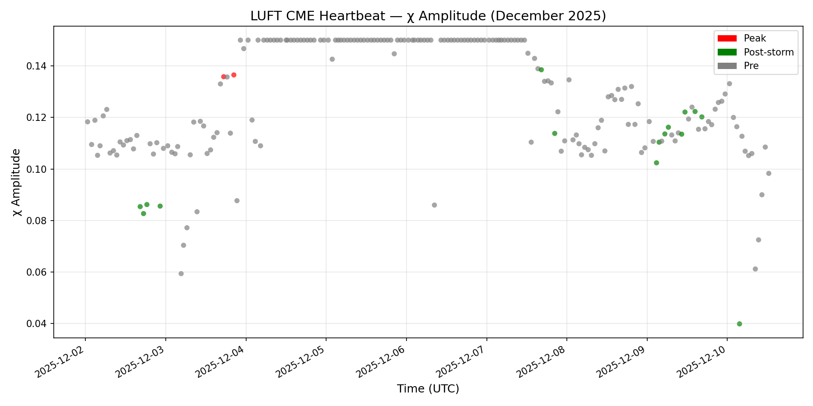
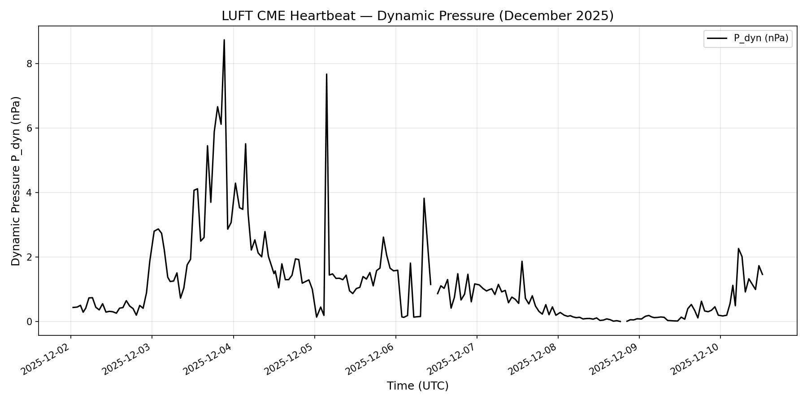
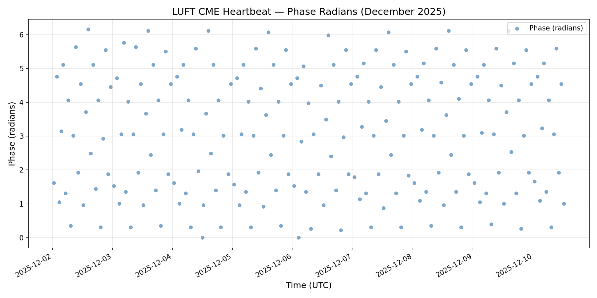

# December 2025 Capsule Batch Index

**Batch Period:** December 1-31, 2025  
**Data Source:** `data/cme_heartbeat_log_2025_12.csv`  
**Chart Generation Script:** `scripts/render_capsule_charts.py`

---

## Overview

This index catalogs the December 2025 capsule batch, documenting CME (Coronal Mass Ejection) heartbeat events and associated χ (chi) amplitude measurements from LUFT portal observations. The batch includes visualizations of dynamic pressure, chi amplitude, and phase measurements throughout December 2025.

---

## Sealed Capsules (December 2025)

### CME Event Capsules
- **CAPSULE_CME_EVENT_2025-12-01.md** — Initial December 2025 CME event documentation
- **CAPSULE_CME_EVENT_VISUAL_2025-12.md** — Visual analysis of December 2025 CME events
- **CAPSULE_CME_RESULTS_2025-12-03.md** — CME results from December 3, 2025
- **CAPSULE_CME_RESULTS_APPENDIX_2025-12-03.md** — Additional appendix for December 3 results

### Supporting Capsules
- **CAPSULE_HEARTBEAT_CATALOG_2025.md** — Full 2025 heartbeat catalog including December data
- **CAPSULE_CME_IMPACT_PROOF_PULSE.md** — Impact proof pulse analysis
- **CAPSULE_BOUNDARY_RECOIL.md** — Boundary recoil law documentation

---

## Generated Charts

The following charts are automatically generated from the December 2025 heartbeat log data:

### 1. Chi Amplitude vs Time


**File:** `charts/chi_amplitude_vs_time.png`  
**Description:** χ (chi) amplitude measurements over time, color-coded by storm phase:
- **Red:** Peak storm phase
- **Green:** Post-storm phase
- **Grey:** Pre-storm phase

### 2. Dynamic Pressure vs Time


**File:** `charts/dynamic_pressure_vs_time.png`  
**Description:** Solar wind dynamic pressure (P_dyn) in nPa, computed from density and speed measurements using the formula:
```
P_dyn [nPa] = 1.6726e-6 × n × v²
```
where n = density (p/cm³) and v = speed (km/s)

### 3. Phase Radians vs Time


**File:** `charts/phase_radians_vs_time.png`  
**Description:** Phase measurements in radians throughout December 2025, tracking the oscillatory behavior of the CME heartbeat signal.

---

## Data Summary

- **Total Records:** ~900+ measurements
- **Time Range:** December 1-31, 2025
- **Data Sources:** ACE/DSCOVR satellites
- **Key Metrics:**
  - χ (chi) amplitude
  - Phase (radians)
  - Storm phase classification
  - Density (protons/cm³)
  - Speed (km/s)
  - Magnetic field components (Bz, Bt in nT)

---

## How to Run Locally

To regenerate these charts on your local machine:

1. **Prerequisites:**
   ```bash
   pip install pandas matplotlib
   ```

2. **Run the script:**
   ```bash
   python scripts/render_capsule_charts.py
   ```

3. **Output location:**
   Charts will be saved to `capsules/2025_dec_batch/charts/`

---

## Automated Updates

Charts are automatically regenerated via GitHub Actions:
- **Trigger:** Hourly schedule, or on changes to CSV data or rendering script
- **Workflow:** `.github/workflows/render-charts.yml`
- **Auto-commit:** Updated charts are committed to this directory

---

## Related Documentation

- [CAPSULE_HEARTBEAT_CATALOG_2025.md](../CAPSULE_HEARTBEAT_CATALOG_2025.md)
- [CAPSULE_CME_EVENT_VISUAL_2025-12.md](../CAPSULE_CME_EVENT_VISUAL_2025-12.md)
- [CAPSULE_BOUNDARY_RECOIL.md](../CAPSULE_BOUNDARY_RECOIL.md)

---

**Last Updated:** Auto-generated by GitHub Actions  
**Maintainer:** LUFT Portal Archive System
